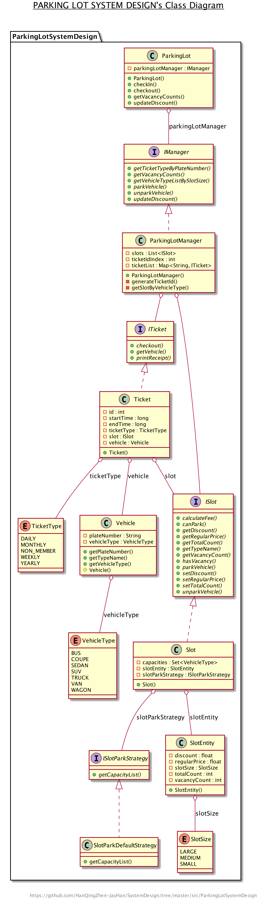

## Parking Lot System Design

### 1. Clarification questions:
- Is this parking lot prepaid or postpaid?

   `postpaid `
 
- How many entrances or exits?

  `Simply one entrance and one exit(If there are multi, concurrent should be concerned.)`
   
- How many sizes in the parking lot?
   
   `SMALL, MEDIUM, LARGE`
   
- Does the parking lot have multi-floors?

   `No. one floor`
   
- Does every size slot have multi-rate according to different period?

    `No. just has only one regular price and a discount`
    
- What kinds of features does this parking lot system have?

   ` - check in`
   
   ` - check out`
   
   ` - show vacancy counts`
   
   ` - promotion`

    
- How many types of tickets?
   
   `You can assume that there are NON_MEMBER,DAILY,WEEKLY,MONTHLY,YEARLY.
   And you also can assume that ther is a membership system exist.`
   
   
### 2. Input & Output
    - check in
    input: vehicle plate number, vehicle type
    output: true: check in successful else failed
    
    - check out
    input: vehicle plate number
    output: fee and print receipt
    
    - show vacancy counts
    input: none
    output: array of vacancy number
    
    - promotion
    input: new discount
    output: none

### 3. Use cases:
    - check in
    System scans a car's plate number and gets car's type from server,
    then check if parking lot has enough space. 
    If check in successs return true and system create a record for this car, else return false.
    
    - check out
    System scan a car's plate number and retrieve record and calculate the fee,
    and also print receipt.
    
    - show vacancy counts
    Syetem will update vacancy counts when check in or checkout occur.
    
    - promotion
    System will update the discount for all type slots and calulates fee with new discount.

### 4. Activity diagrams:

### 5. Class diagrams:
